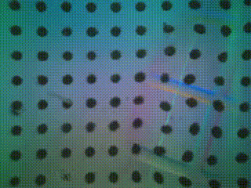
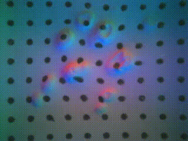
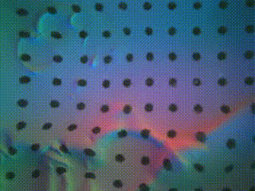
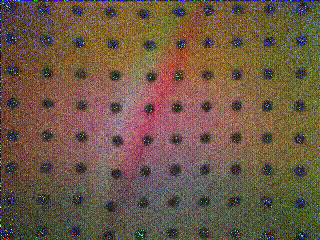
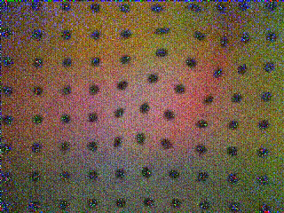

# Attention-Classification

**Slip detection** with [Franka Emika](https://www.franka.de/) and [GelSight Sensors](https://www.gelsight.com/gelsightmini/).

**Author**: [Amit Parag](https://scholar.google.com/citations?user=wsRIfL4AAAAJ&hl=en)

**Instructor**: [Ekrem Misimi](https://www.sintef.no/en/all-employees/employee/ekrem.misimi/)

## Précis

An important aspect of robotic grasping is the ability to detect incipient slip based on real time information through tactile sensors. In this paper, we propose to use Video Vision Transformers to detect the onset of slip in grasping scenarios. The dynamic nature of slip makes Video Vision Transformers a suitable candidate to capture temporal correlations with relatively fewer data. The training data is acquired through two Gelsight tactile sensors attached to the generic finger grippers of a  Panda Franka Emika robot arm that grasps, lifts and shakes $30$ daily objects. We evaluate the efficiency of the our approach to predict onset of slip on $10$ previously unseen objects and achieve a zero-shot mean prediction accuracy of 99\%. 

The aim of the experiments is to learn the difference between slip and wriggle (and predict the onset of slip) through videos by training a Video-Vision Transformer model.

We use the Franka Emika research 2 robots and libfranka to move the robots. See [notes](./notes/readme.md) on installing the real time kernel and libfranka.

Video Vision Transformers were initially proposed in this [paper](https://arxiv.org/abs/2103.15691).

We use the first variant - spatial transformer followed by a temporal one - in our experiments.

The training dataset was collected by performing the wriggling motion.

We define "wriggle" as a sequence of motions that involve:

- **Perpendicular Shake**: This type of shake involves applying a perturbation perpendicular to the surface or direction of motion. It induces movement in a direction perpendicular to the end-effector's current orientation or path.
- **Rotation Shake**: Rotation shake applies a perturbation that causes the end-effector to rotate around its axis. This rotation can be clockwise or counterclockwise, altering the orientation of the end-effector.
- **Tangential Shake**: Tangential shake induces movement along a tangent to the end-effector's path or surface. It applies a perturbation parallel to the direction of motion, causing lateral movement without altering the orientation.
- **Vertical Shake**: Vertical shake involves applying a perturbation that induces movement along the vertical axis of the end-effector. This perturbation causes the end-effector to oscillate or move vertically, either upward or downward, relative to its current position.

Two examples are shown below:

- 
- 

The occurrence of slip is usually characterized by the properties of the object in question such as its weight, elasticity, orientation of grip.

An examples of slip are shown below:

This motion is repeated for a number of objects to gather data.

The resulting (slip) video (from one of the experiments) from the sensor attached to the gripper is shown below:

- 
- 

An example of wriggle is:

- 

After the data has been collected, we augment the data by adding noise and swapping channels in each video.

Transformed videos of 5 frames would look like:

- 
- 

## Training

For training, the data folder needs to be arranged like so:

      root_dir/
      
        ├── train/
    
         ├── slip/
      
             ├── video1.avi
      
             ├── video2.avi
      
             └── ...
       
        └── wriggle/
         
            ├── video1.avi
      
            ├── video2.avi
      
            └── ...
  
        
      ├── test/
    
         ├── slip/
      
             ├── video1.avi
      
             ├── video2.avi
      
             └── ...
       
        └── wriggle/
         
            ├── video1.avi
      
            ├── video2.avi
      
            └── ...
  
  
              
      ├── validation/
    
         ├── slip/
      
             ├── video1.avi
      
             ├── video2.avi
      
             └── ...
       
        └── wriggle/
         
            ├── video1.avi
      
            ├── video2.avi
      
            └── ...
    

## ViViT Architecture

- `image_size`: (240,320), # image size
- `frames`: 5, # number of frames
- `image_patch_size`: (40,40), # image patch size
- `frame_patch_size`: 5, # frame patch size
- `num_classes`: 2,
- `dim`: 8,
- `spatial_depth`: 2, # depth of the spatial transformer
- `temporal_depth`: 2, # depth of the temporal transformer
- `heads`: 2,
- `mlp_dim`: 2

Training a bigger model on 16 or 32 Gb RAM leads to the script getting automatically killed. So, if you want to try it, make sure you have access to compute clusters and adapt the code for GPU. Should be fairly straightforward. 

## Certain problems you may face

1. **Installing real-time kernel**: See requirements below.
2. **Marker Tracking**: Marker tracking algorithms may fail to converge or end up computing absurd vector fields. We experimented with marker tracking but ended up not using them.
3. **Sensors**: The Gelsight sensors are susceptible to damage. After a few experiments, the gel pad on one of the sensors started to leak gel while the second one somehow got scrapped off. This happens irritatingly often.
- 

4. **Minor Convergence issues in the initial epochs**: Sometimes, the network gets stuck in local minima. Either restart the experiment with a different learning rate or let it run for a few more epochs. For example, in one of the experiments, the network was trapped in a local minima - the validation accuracy score remained unchanged for 100 epochs for a learning rate of 1e-3. The usual irritating local minima stuff - change some parameter slightly.
5. **OpenCV issues**: There are a few encoding issues with OpenCV something to do with how it compresses and encodes data.

## Requirements

The usual suspects - torch, pytorchvideo, opencv.

Numpy, preferably 1.20.0. Higher versions have changed numpy.bool to bool. Might lead to clashes.

See [notes](https://github.com/amitparag/Attention-Classification/tree/main/notes) for instructions on installing real-time kernel and libfranka.

## License

This project is licensed under the BSD 2-Clause Simplified License.

